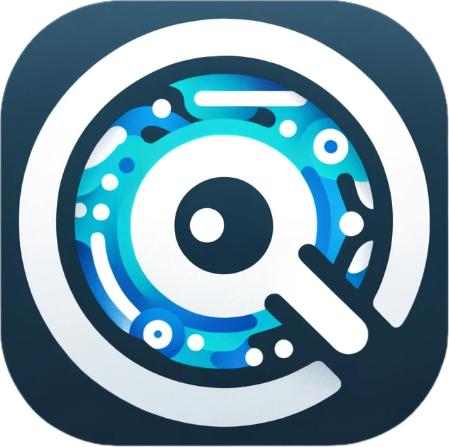

# Cenvoy - AI Browser Assistant Chrome Extension

**Bring Your Own AI Agent right into your browser!** Transform your web browsing with powerful OpenAI integration.

## 🌟 Overview

Cenvoy is a powerful Chrome extension that brings AI assistance directly into your browsing experience. Simply highlight text on any webpage, right-click, and send it to OpenAI's powerful language models (GPT-3.5, GPT-4) for instant assistance, analysis, or transformation.

## 📋 Table of Contents
- [Features](#features)
- [Installation](#installation)
- [Setup](#setup)
- [Usage](#usage)
- [Configuration Options](#configuration-options)
- [Contributing](#contributing)
- [License](#license)
- [Acknowledgments](#acknowledgments)

## ✨ Features

- 🔍 **Context Menu Integration**: Highlight any text on a webpage and access AI assistance directly through your browser's context menu
- 📝 **Custom Prompt Templates**: Create and save your own prompt templates for specific tasks
- 🧠 **AI-Guided Template Creation**: Simply describe what you want your prompt to do, and the extension will generate it for you
- 🔄 **Multi-step Workflows**: Build sequential AI processing workflows that pass content through multiple prompts
- 🤖 **Flexible Model Selection**: Choose from various OpenAI models including GPT-3.5 Turbo, GPT-4, and add custom models
- 🔑 **Flexible API Key Management**: Use a global API key or set specific keys for individual templates
- 📱 **Elegant UI**: Beautiful, draggable response interface with Markdown support
- 🔄 **Continued Conversations**: Follow up with additional queries in the same conversation
- 💻 **Cross-browser Compatibility**: Works seamlessly in Chrome (more browsers coming soon)
- 🛠️ **Customizable Experience**: Tailor the extension to fit your specific workflow needs
- 📄 **Page Content Summarization**: Get AI-powered summaries of entire webpage content with a single click
- ❓ **Interactive Q&A**: Ask questions about the current page content and get contextual answers

## 📥 Installation

### 🛍️ From Chrome Web Store
*(Coming Soon)*

### 🔧 Manual Installation
1. Download or clone this repository
2. Open Chrome and navigate to `chrome://extensions/`
3. Enable "Developer mode" (toggle in the top-right corner)
4. Click "Load unpacked" and select the extension directory
5. Ready to go! The extension icon should appear in your toolbar

## ⚙️ Setup

1. Click the extension icon or right-click anywhere and select "Options..."
2. Enter your OpenAI API key in the "Global API Key" section
3. Create custom templates or use the AI to generate them for you!

## 🚀 Usage

### 💬 Basic Usage
1. Highlight any text on a webpage
2. Right-click to open the context menu
3. Select "Ask OpenAI" for instant AI assistance
4. View the response in a sleek, draggable interface

### 📄 Page Content Summarization
1. Click the extension icon in your toolbar
2. Select "Summarize Page" from the dropdown menu
3. Get an AI-generated summary of the entire webpage content
4. Use the summary for quick understanding or reference

### ❓ Question Answering
1. Click the extension icon in your toolbar
2. Select "Ask Questions" from the dropdown menu
3. Type your question about the current page
4. Receive AI-powered answers based on the page content
5. Continue the conversation with follow-up questions

### 📝 Custom Templates
1. Create templates in the Options page
2. Highlight text on any webpage
3. Right-click and select your custom template
4. Watch the AI work its magic!

### 🔄 Creating Workflows
1. Create a new template and enable "Workflow Steps"
2. Add multiple processing steps that build upon each other
3. Use `{selection}` for original text and `{previousOutput}` for chain processing
4. Create powerful multi-step AI transformations!

### 🧠 AI-Guided Template Creation
1. Click "AI Guided Setup" when creating a new template
2. Describe what you want your prompt to do
3. Let the AI generate the perfect template for you
4. Review, tweak if needed, and save!

### 🤖 Model Management
1. Click "Manage Models" next to the model dropdown
2. Add custom models, reorder by dragging, remove unused ones
3. Customize your AI toolkit to fit your needs

## 🔧 Configuration Options

### 🔑 Global Settings
- **API Key**: Your default OpenAI API key for all templates

### 📋 Template Settings
- **Title**: The name in your context menu
- **Prompt Content**: Instructions for the AI (use `{selection}` as placeholder)
- **OpenAI Model**: Choose your preferred AI model
- **Specific API Key**: Optional override for this template
- **Workflow Steps**: Chain multiple AI operations together

### ⚡ Model Management
- Add custom OpenAI models by ID
- Drag to reorder your favorites
- Remove unused models (GPT-4 always stays)

## 💡 Use Cases

- 📊 **Research Assistant**: Instantly summarize and analyze web content
- 💻 **Code Helper**: Understand and improve code snippets
- 🌐 **Translation Tool**: Convert text to any language
- ✏️ **Content Creator**: Generate creative variations of existing text
- 🎓 **Learning Companion**: Get clear explanations of complex topics
- 📚 **Quick Reading**: Get instant summaries of long articles and documents
- 🔍 **Content Navigation**: Ask questions to quickly find specific information on a page

## 🔍 Technical Details

Built with:
- ☕ JavaScript
- 🧩 Chrome Extension Manifest V3
- 🤖 OpenAI API
- 📄 Marked.js for Markdown rendering

## 👥 Contributing

Got ideas? Contributions welcome! Feel free to submit a Pull Request.

## 📜 License

This project uses the Non-Commercial Open Source License (NCOSL) 1.0. See the [LICENSE](LICENSE) file.

For commercial use, please contact the copyright holder.

## 🙏 Acknowledgments

- Thanks to [marked.js](https://github.com/markedjs/marked) for Markdown magic!

---

Created with ❤️ by Zhiyuan Ma 

## 🔍 Keywords

Chrome Extension, Browser Extension, OpenAI, GPT, AI Assistant, Text Processing, Context Menu, Workflow Automation, Prompt Templates, Web Browsing Enhancement, Chrome Plugin, AI Tools, GPT-3.5, GPT-4 